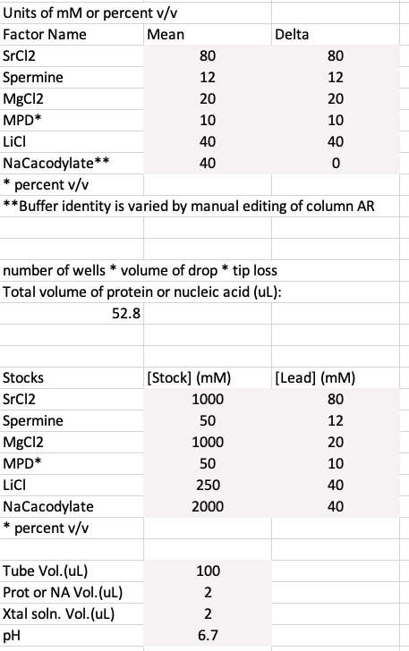
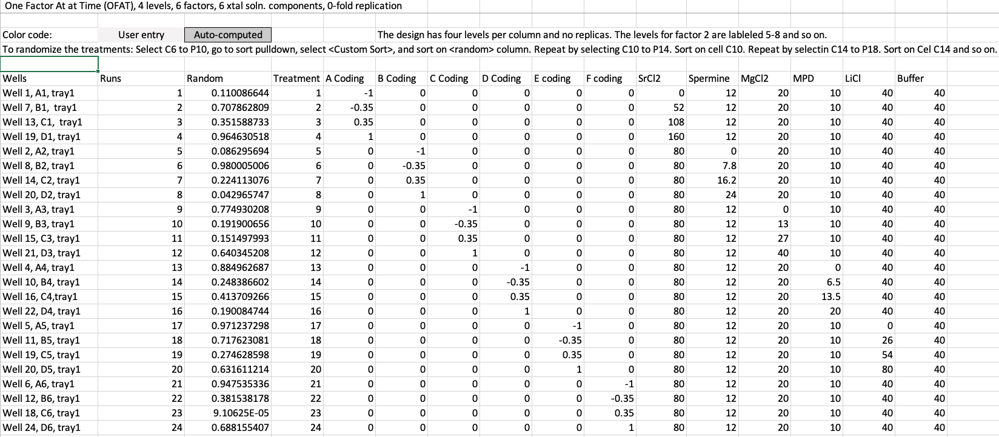

# Varying One-Factor-at-a-Time (OFAT) Experimental Designs

## Purpose
This repository contains Excel spreadsheets for applying OFAT Designs (OFATs) to the size optimization of crystals of biological macromolecules (proteins and nucleic acids).
these spreadsheets can be adapted to other biochemical experiments as explained below.
They can also be adapted to stochastic computer experiments.

Crystal size is generally proportional to its diffraction power, provided the crystal is not internally disordered and properly cryoprotected.
Crystallographers seek large crystals to obtain high-resolution data for high-quality structures.

The growth of large protein crystals is highly reproducible when near the optimal conditions.
You know that you have found the optimal conditions when replica drops return a single large crystal per drop.
With these optimal conditions, you can generate hundreds of large crystals for the purpose of finding favorable cryo conditions and for the purpose of doing ligging soaks and heavy atom soaks.
The highly reproducible nature of crystallization results is one of the strengths of protein crystallography as an experimental method.

Workers who report difficulty reproducing crystals likely found them on the steep slope of the response surface below the peak of optimal conditions.
On the steep slope of the response surface, the factors very rapidly and are difficult to reproduce.
In contrast, the gradients in the factors are close to zero at the peak which explains why the peak conditions are reproducible.

## What are OFAT experiments
These OFAT experiments involve holding all factors constant except for one while it is varied over several factor levels. 
We recommend starting the variation at 0 to test whether a factor's presence or absence influences crystal growth. 
We also recommend using four factor levels, including the zero level, so that the three points with the factor present can be used to assess whether the response is linear or curvilinear.

Most factors are expected to have a concave curvilinear effect on the crystallization of biological molecules.
The effect might appear linear if the range of tested factor levels is narrow.
In this case, you might be exploring only the rising or falling shoulder of a quadratic response.

Four levels is a minimal approach to detecting the curvilinear response.
Five or six levels might be a more robust approach to characterizing of the curvilinear nature of the response.

This is about all you can expect out of these kinds of experiments.
You may propagate your lead when testing factors that do not influence crystallization.
This might be a side benefit if the crystallization conditions are close to the optimum.

These OFAT experiments are a horrible way to find the optimal conditions when serially applying them.
They should be limited to exploring a factor's nature in terms of whether its presence has an effect and detecting a curvilinear response.
This information can then be used to select the factors and their levels in full factorial, incomplete factorial, or optimal experimental designs.
These latter designs can detect at least two-way interactions in addition to quadratic responses.

## Replication and randomization
The typical practice is not to create replica crystallization experiments to save time and expensive samples.
That is, the standard practice is to do exploratory trials rather than statistically valid experiments that return an assessment of the variation.

These spreadsheets contain replica OFAT experiments to assess the variation in the results.
The sources of the variation include stochastic errors outside the experimenter's control and systematic experimental errors associated with assembling the stock solutions and dispensing them.

While you might be tempted to feed these designs into a liquid-handling robot, you should look into the robots' coefficients of variation.
It is much higher than you might think.
In addition, it can take about 12-20 hours of tedious editing an input CSV file to read one of these designs by the liquid handling robot.
Using a liquid handling robot once the csv file is in working order and can be used repeatedly after minor modification for each experimental design might yield some efficiencies.
However, for small volumes, one has to worry about evaporative losses during the assembly of the solutions.
These are the main sources of variation in the final volumes rather than pipetting errors.

The treatments within the replicas are randomly assigned.
Each of those experiments is treated as an independent experiment, so there is no randomization across the experiments.
This latter feature eases the setting up of the crystallization solutions within a OFAT experiment because only the volume of one factor and the volume of the water vary.

The protocol for re-randomization of the treatments in experiment with no replica is as follows:

- Select cells C6 to P1
- Go to sort pulldown
- Select <Custom Sort>
- Sort on <random> column.
- Repeat by selecting C11 to P14.
- Custom sort on column C.
- Repeat by selecting C15 to P18. Custom sort column C and so on.

## Customizing the design for your experiment
It takes about 3 minutes to edit a spreadsheet to customize it for a new crystallization experiment.
The cells shaded light gray require editing.

These spreadsheets ease applying OFATs in laboratory experiments.
These spreadsheets could also be adapted to other laboratory and field experiments.
If you need a design with a run configuration different from a 4 x 6 array, please post an issue.

## Codings and treatments

A design matrix with the codings of the factor levels is applied to the user-entered concentration ranges.

## Use outside of crystallization experiments
These expendable designs can be adapted to other biochemical experiments involving aqueous solutions where water is the dominant component.
When water is not the dominant component, experimental designs for mixtures must be used.
One could also envision adapting these experimental designs to computer experiments where the results are stochastic in nature.

