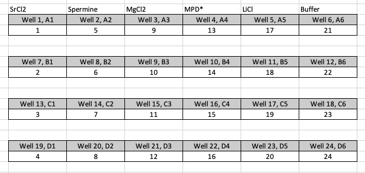
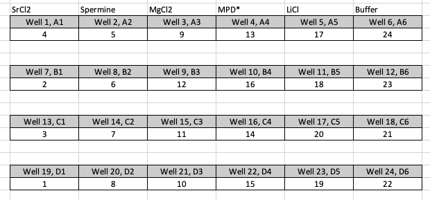
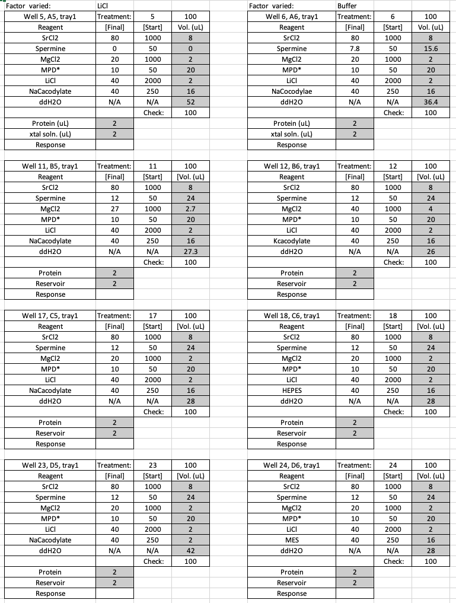

# Varying One-Factor-at-a-Time (OFAT) Experimental Designs

This sentence uses $\` and \`$ delimiters to show math inline:  $`\sqrt{3x-1}+(1+x)^2`$

## Purpose
This repository contains Excel spreadsheets for applying OFAT Designs (OFATs) to the size optimization of crystals of biological macromolecules (proteins and nucleic acids).
These designs are developed to be deployed in 4x6 24-well crystallization plates.
These spreadsheets can be adapted to other biochemical experiments as explained below.
They can also be adapted to stochastic computer experiments.

Crystal size is generally proportional to its diffraction power, provided the crystal is not internally disordered and properly cryoprotected.
Crystallographers seek large crystals to obtain high-resolution data for high-quality structures.

The growth of large protein crystals is highly reproducible when near the optimal conditions.
You know that you have found the optimal conditions when replica drops return a single large crystal per drop.
With these optimal conditions, you can generate hundreds of large crystals to find favorable cryo conditions and for ligand and heavy atom soaks.
One of the strengths of protein crystallography as an experimental system is the highly reproducible nature of crystallization results.

Workers who report difficulty reproducing crystals likely found them on the steep slope of the response surface below the peak of optimal conditions.
On the steep slope of the response surface, the factors very rapidly and are difficult to reproduce.
In contrast, the gradients in the factors are close to zero at the peak which explains why the peak conditions are reproducible.

## Features to ease the use of the design

- Treatments for one factor are listed in a column rather than across columns to ease the analysis of the results
- Support for randomization of the treatments within a factor.
- User input is specified in the light gray-shaded cells.
- Automated updating of all the required volumes.
- The difference between the expected final volume and the sum of the non-water components to check to ensure that it is greater than 0. If the sum is negative, the cell will turn red.
- The total volume of the aliquots for one crystallization solution is checked to ensure that it sums to the target volume. If the sum does not equal the target value, the cell will turn red.
- The user is free to specify the total volume, this is not hardwired.
- The total volume of aliquots for each stock solution is summed across all 24 wells so that the user knows in advance what volume of stock solution they will need for each required stock solution. They can compare these volumes to the available stocks to determine if they need to make new solutions. They should use only the new solutions rather than stock solutions of two different ages prepared at different times because this could be a source of experimental variability.
- A table of the assigned treatments to the crystallization tray after randomization can also be used to record observations of the crystallization drops.
- A crystal scorecard is included for convenience.

## What are OFAT experiments?
These OFAT experiments involve holding all factors constant except for one while it is varied over several factor levels. 
We recommend starting the variation at 0 to test whether a factor's presence or absence influences crystal growth. 
Here, we test four levels of each factor, including the zero level, so that the three points with the factor present can be used to assess whether the response is linear or curvilinear.

Most factors are expected to have a concave curvilinear effect on the crystallization of biological molecules.
Convex curvilinear effects may occur occasionally.
The effect might appear to be linear if the range of the tested factor levels is narrow.
In this latter case, you may be exploring only the rising or falling shoulder of a quadratic response.

Four levels is a minimal approach to detecting the curvilinear response.
Five or six levels might be a more robust approach to characterizing the curvilinear nature of the response.
However, the larger number of factor levels rapidly increases the size and expense of the experiment.

This is about all you can expect out of these kinds of experiments.
You may propagate your lead when testing factors that do not influence crystallization.
This might be a side benefit if the crystallization conditions are close to the optimum.

These OFAT experiments are a horrible way to find the optimal conditions when serially applied.
They should be limited to exploring a factor's nature regarding whether its presence has an effect and detecting a curvilinear response.
This information can then be used to select the factors and their levels in full factorial, incomplete factorial, or optimal experimental designs.
These latter designs can detect at least two-way interactions in addition to quadratic responses.

## Replication and randomization
The typical practice is to avoid creating replica crystallization experiments to save time and expensive samples.
That is, the standard practice is to do exploratory trials rather than statistically valid experiments that return an assessment of the variation.

**Ordered:**

**Randomized:**

The treatments within a factor should be randomly assigned.
Each of those experiments is treated as an independent experiment, so there is no randomization across the experiments.
This latter feature eases the setting up of the crystallization solutions within an OFAT experiment because only the volume of one factor and the volume of the water vary.

The protocol for re-randomization of the treatments in an experiment with no replica is as follows:

- Select cells C6 to P11
- Go to sort pulldown
- Select <Custom Sort>
- Sort on <random> column.
- Repeat by selecting C11 to P14.
- Custom sort on column C.
- Repeat by selecting C15 to P18. Custom sort column C and so on.

To aid in interpreting the results, you can enter them in the column to the right of the table that contains the coatings and factor levels. 
Then, you can resort to the columns by treatment by selecting D6 to P10 and sorting on the treatment column.
Repeat five more times for the other factors.
The reordered table will be much easier to interpret when detecting whether the trends are linear or curvilinear with increasing factor levels.

## Liquid handling robot

While you might be tempted to feed these designs into a liquid-handling robot, you should look into the robots' coefficients of variation (CV).
It may be much higher than you expected.
One popular liquid-handling robot has a CV of 5%; I was expecting a CV of 1%.
Your manual pipetting CV may be less than 2% if you minimize evaporative losses during the dispensing of the stock solution.
In addition, it can take about 12-20 hours of tedious editing of an input CSV file to read one of these designs by the liquid handling robot.

Using a liquid handling robot once the csv file is in working order and can be used repeatedly after minor modification for each experimental design might yield some efficiencies.
However, for small volumes, one has to worry about evaporative losses during the assembly of the solutions.
These losses may be the primary sources of variation in the final volumes rather than pipetting errors.

## Customizing the design for your experiment

It takes about 3 minutes to edit a spreadsheet to customize it for a new crystallization experiment.
The cells shaded light gray require editing.

Please note that we were setting up 100 microliter volumes using the mini-screen approach, which is popular in nucleic acid crystallography. 
In this approach, the crystallization solution is mixed with the sample stock solution but not put in the reservoir, unlike the standard practice in protein crystallography.
This approach minimizes using expensive and toxic chemicals in the crystallization solution.
This is a greener approach to crystallization experiments.

This approach also allows you to reuse the crystallization tray because you are not withdrawing components from the reservoir solution that may not be RNase-free despite your efforts to clean the reservoir between uses.
The recycling of crystallization plates saves money and reduces plastic waste.

If you make the reservoir solutions according to the standard protein crystallization practice, you can change the volume to 1,000 microliters.
You can use 350 microliters, which is sufficient to cover the bottom of a standard 24-well crystallization plate.
The surface area of the reservoir solution matters more than its volume.
If you want to make stock solutions for 15 mL or 50 mL Falcon tubes, you could change the volume from 100 microliters to 15,000 or 50,000 microliters.

The spreadsheet makes it easy to apply OFATs in laboratory experiments.
These spreadsheets could also be adapted to other laboratory and field experiments.
If you need a design with a run configuration different from a 4 x 6 array, please post an issue.

## Codings and treatments

A design matrix with the codings of the factor levels is applied to the user-entered concentration ranges.
This matrix has five continuous factors and one categorical factor.
In this case, the categorical factor is the buffer's identity.
The buffer identity has to be entered by hand in column AR.

The reservoir's crystallization and precipitant solution are independent in a mini-screen setup.
You can set up a factor that is the concentration of the precipitating agent in the reservoir solution.
This is often an active factor with a quadratic effect on crystal size.
This factor should always be varied. 
In the case shown here, we can make a second copy of the worksheet and vary the precipitant concentration in column 1 of a second tray.

## What if you have fewer than six chemical factors?
If the solution for your crystallization lead has fewer than six chemical components and you use the mini-screen approach, you can use one of the unneeded columns to vary the concentration of the precipitating agent in the reservoir.
You can also use the unused columns for testing physical parameters like drop size and sample volume ratio to crystallization solution volume.

you can also use an unused column for the purpose of repeating one of the factors.
this partial replication will provide some measure of the variability in your experiment.
it would be better to do replica experiments.
you can set up a replica tray with a different randomization of the treatments within each column.

A more rigorous approach would be to have the replica columns adjacent to each other and randomize the treatments within this column and row block.
We are working on spreadsheets that will support the presence of one, two, or three replicas, with the replica columns grouped together.

## Autogenerated Recipes

The recipes for each crystallization solution are automatically generated for continuously varying factors based on the user-supplied input.
The recipes for categorical factors, like buffer identity, must be entered by hand.
The column on the left below is for a continuous factor.
The column on the right is for a categorical factor.

Pairs of columns can be selected in Excel and fit to the page for printing. 
One 6 x 4 experiment will require three laboratory notebook pages.

## Printing the design

Invariably, you will want to print out the workbook for the purpose of pasting it into a laboratory notebook.
The printing of all the components of the spreadsheet requires the setting of several print areas within Excel.
It takes about 10 to 20 minutes to carry out this task so allow sufficient time.

This is the protocol that we use:

- Select the table or tables that you want to print on a page
- Under the file pulled down select Print Area/Set Print Area
- Select print. in the print dialog, select portrait mode and scale to page
- Click on the blue Print button after selecting the appropriate printer
- Under the file pulled down, select Print Area/Clear Print Area
- Repeat the cycle.

The workbook can probably be printed from other software that can read Excel files (e.g., Libre Office, Open Office, Numbers), following a similar protocol.
  

## Use outside of crystallization experiments
These experimental designs can be adapted to other biochemical experiments involving aqueous solutions where water is the dominant molar component.
When water is not the dominant component in a mixture, experimental designs for mixtures must be used.

One could also envision adapting these experimental designs to computer experiments where the results are stochastic.

## Sources of funding

- NIH: R01 CA242845
- NIH: R01 AI088011
- NIH: P30 CA225520 (PI: R. Mannel)
- NIH P20GM103640 and P30GM145423 (PI: A. West)
